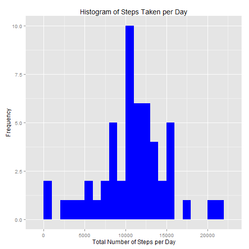
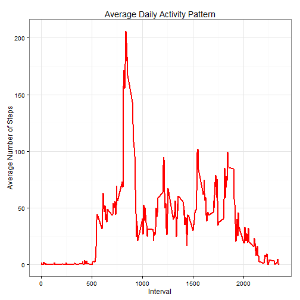
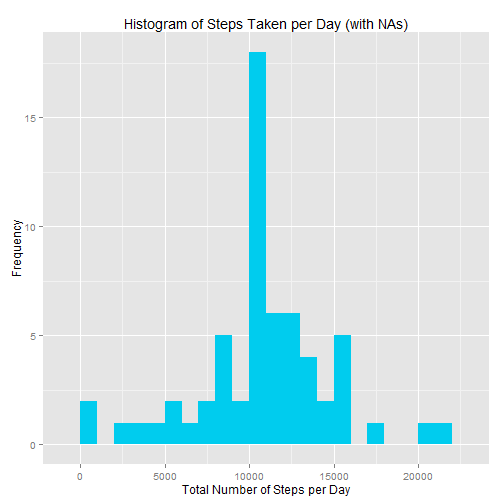
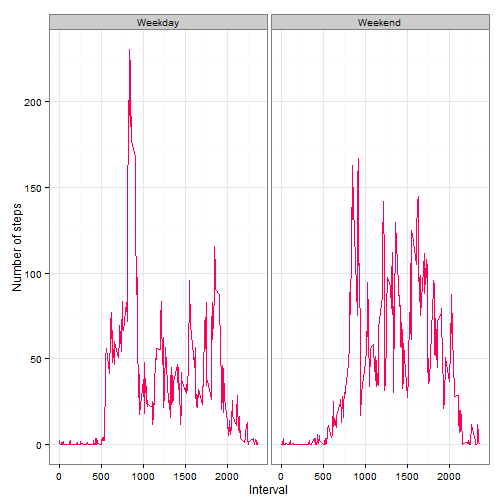

# Introduction

This is an R Markdown document for the Coursera course Reproducible Research.
In it we present the results for peer assessment 1

This assignment makes use of data from a personal activity monitoring device. This device collects data at 5 minute intervals through out the day. The data consists of two months of data from an anonymous individual collected during the months of October and November, 2012 and include the number of steps taken in 5 minute intervals each day.

## Loading libraries
Load the libraries we will use in this assignment.

```r
library(knitr)
opts_chunk$set(echo = TRUE, results = 'hold')
```

We use ggplot2 for graphing and data.table for convenience.
We use lubridate to identify dates by days of the week.


```r
library(data.table)
```

```
## data.table 1.9.4  For help type: ?data.table
## *** NB: by=.EACHI is now explicit. See README to restore previous behaviour.
```

```r
library(ggplot2)
```

## Loading and preprocessing the data

Load the data.


```r
activity_data <- read.csv("activity.csv", header = TRUE, sep = ",")
```

Process/transform the data into a format suitable for analysis.


```r
activity_data$date <- as.Date(activity_data$date, format = "%Y-%m-%d")
```

## What is mean total number of steps taken per day?

*For this part of the assignment, ignore the missing values in the dataset.*


Calculate the total number of steps taken per day.


```r
# Note that aggregate ignores NAs by default
daily_steps_no_NA <- aggregate(steps ~ date, activity_data, sum)
```

Make a histogram of the total number of steps taken each day.


```r
ggplot(daily_steps_no_NA, aes(x = steps)) + geom_histogram(fill = "blue", binwidth = 1000) + 
  labs(title="Histogram of Steps Taken per Day", x = "Total Number of Steps per Day", y = "Frequency")
```

 

Calculate and report the mean and median of the total number of steps taken per day.


```r
mean(daily_steps_no_NA$steps)
```

```
## [1] 10766.19
```


```r
median(daily_steps_no_NA$steps)
```

```
## [1] 10765
```


## What is the average daily activity pattern?

#### Make a time series plot (i.e. type = "l") of the 5-minute interval (x-axis) and the average number of steps taken, averaged across all days (y-axis)
Calculate the means of steps by intervals of 5-minutes 
Convert the intervals to integers and save them in a data frame.


```r
steps_interval_data <- aggregate(activity_data$steps, by = list(interval = activity_data$interval),
                                 FUN=mean, na.rm=TRUE)

names(steps_interval_data) <- c("interval", "mean")
```

Make a time series plot of the 5-minute intervals


```r
ggplot(steps_interval_data, aes(x=interval, y=mean)) + geom_line(color="red", size=1) +  
        labs(title="Average Daily Activity Pattern", x="Interval", y="Average Number of Steps") + 
        theme_bw()
```

 

#### Which 5-minute interval, on average across all the days in the dataset, contains the maximum number of steps?


```r
max_interval <- steps_interval_data[which.max(steps_interval_data$mean),]

max_interval
```

```
##     interval     mean
## 104      835 206.1698
```
The interval between 835 and 840 minutes has (on average) the maximum number of steps, at roughly 206 steps.

## Imputing missing values

Note that there are a number of days/intervals where there are missing
values (coded as `NA`). The presence of missing days may introduce
bias into some calculations or summaries of the data.

1. Calculate and report the total number of missing values in the dataset (i.e. the total number of rows with `NA`s)


```r
missing_values <- sum(is.na(activity_data$steps))
missing_values
```

```
## [1] 2304
```
The total number of missing values is 2304.

2. Devise a strategy for filling in all of the missing values in the dataset. The strategy does not need to be sophisticated. For example, you could use the mean/median for that day, or the mean for that 5-minute interval, etc.


We replace each instance of NA by its mean in the interval.


```r
mean_steps <- aggregate(steps ~ interval, data = activity_data, FUN = mean)
fill_NA <- numeric()
for (i in 1:nrow(activity_data)) {
    fill_row <- activity_data[i, ]
    if (is.na(fill_row$steps)) {
        steps <- subset(mean_steps, interval == fill_row$interval)$steps
    } else {
        steps <- fill_row$steps
    }
    fill_NA <- c(fill_NA, steps)
}
```

3. Create a new dataset that is equal to the original dataset but with the missing data filled in.


```r
new_activity_data <- activity_data
new_activity_data$steps <- fill_NA
```

4. Make a histogram of the total number of steps taken each day and Calculate and report the **mean** and **median** total number of steps taken per day. Do these values differ from the estimates from the first part of the assignment? What is the impact of imputing missing data on the estimates of the total daily number of steps?


```r
daily_steps_with_NA <- aggregate(steps ~ date, new_activity_data, sum)
```

Plot the histogrm.

```r
ggplot(daily_steps_with_NA, aes(x = steps)) + geom_histogram(fill = "#00CCEE", binwidth = 1000) + 
  labs(title="Histogram of Steps Taken per Day (with NAs)", x = "Total Number of Steps per Day", y = "Frequency")
```

 

Calculate the mean and median of the new data set.


```r
mean(daily_steps_with_NA$steps)
```

```
## [1] 10766.19
```


```r
median(daily_steps_with_NA$steps)
```

```
## [1] 10766.19
```
The effect of imputing the missing data is slight on the median and non-existant on the mean.

## Are there differences in activity patterns between weekdays and weekends?

1. Create a new factor variable in the dataset with two levels -- "weekday" and "weekend" indicating whether a given date is a weekday or weekend day.


```r
day <- weekdays(new_activity_data$date)
daylevel <- vector()
for (i in 1:nrow(new_activity_data)) {
    if (day[i] == "Saturday" || day[i] == "Sunday") {
        daylevel[i] <- "Weekend"
    } else {
        daylevel[i] <- "Weekday"
    }
}
new_activity_data$daylevel <- daylevel
new_activity_data$daylevel <- factor(new_activity_data$daylevel)

new_daily_steps <- aggregate(steps ~ interval + daylevel, data = new_activity_data, mean)
names(new_daily_steps) <- c("interval", "daylevel", "steps")
```

2. Make a panel plot containing a time series plot (i.e. `type = "l"`) of the 5-minute interval (x-axis) and the average number of steps taken, averaged across all weekday days or weekend days (y-axis).


```r
ggplot(new_daily_steps, aes(x=interval, y=steps)) + 
        geom_line(color="#FF0055") + 
        facet_wrap(~ daylevel, nrow=1, ncol=2) +
        labs(x="Interval", y="Number of steps") +
        theme_bw()
```

 

There are clear differences between the numbers of step over the weekdays and over the weekend.
We see the tallest spike during the weekday and otherwise, numbers of steps remaining below 125.
However, during the weekend, the numbers of steps are consistently above 100 (and frequently close to 150).
